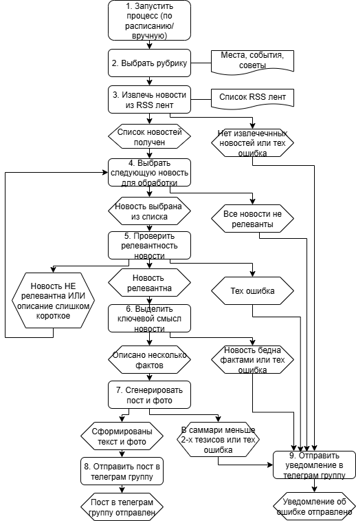

# Архитектура системы

Система построена как набор логически изолированных сервисов, взаимодействующих через платформу оркестрации.

В рамках системы термин «сервис» обозначает логически изолированный компонент с чётко определённой зоной ответственности и контрактом взаимодействия.

Конкретная форма реализации сервиса (HTTP-сервис, workflow, подпроцесс) не влияет на его архитектурную роль.

---

# Общая схема

---

# Сервисы системы

## 1. Сервис извлечения данных

Ответственность:

- получение данных из RSS-источников
- управление окнами данных
- структурная и техническая валидация
- нормализация формата
- защита системы от некорректных данных

Результат работы:

→ данные существуют и готовы к обработке

Реализация:

n8n workflow: n8n/workflows/Extract_RSS.json

---

## 2. Сервис фильтрации

Ответственность:

- проверка релевантности
- контентная валидность
- бизнес-валидность
- классификация
- принятие решений об использовании данных

Результат работы:

→ данные признаны полезными

Реализация:

n8n workflow: n8n/workflows/Check_news_relevance.json  
OpenAI API

---

## 3. Сервис суммаризации

Ответственность:

- извлечение ключевых и интересных фактов
- устранение избыточности
- структурирование информации
- сохранение семантической точности

Вне зоны ответственности:

- стиль и подача контента

Результат работы:

→ извлечён структурированный смысл новости

Реализация:

n8n workflow: n8n/workflows/Summarize_news_item.json  
OpenAI API

---

## 4. Сервис генерации контента

Ответственность:

- генерация текста в заданном стиле и объеме
- генерация изображения по тематике поста в заданном стиле
- адаптация под формат Telegram

Вне зоны ответственности:

- проверка релевантности
- проверка достоверности фактов

Результат работы:

→ сформирован готовый контент

Реализация:

HTTP-сервис: tourism_gen  
OpenAI API  
Yandex Cloud API

---

## 5. Сервис оркестрации

Ответственность:

- запуск сценария
- координация сервисов
- управление pipeline
- публикация в Telegram
- обработка ошибок и информационные сообщения в Telegram

Вне зоны ответственности:

- логика отдельных сервисов

Результат работы:

→ бизнес-процесс выполнен

Реализация:

n8n workflow: n8n/workflows/Main.json

---

